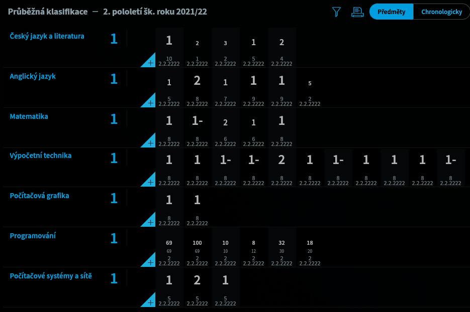

# bakalari-extension
Extension for chrome and firefox(later). Features average by subject, average overall, predictor, wide mode, big marks...
# Install
Download https://github.com/AdamJedl/bakalari-extension/releases/latest/download/bakalari-extension-chrome.crx

Drag bakalari-extension-chrome.crx and drop it to extensions(chrome://extensions/)
# Before

# After

